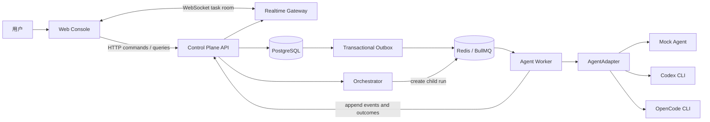
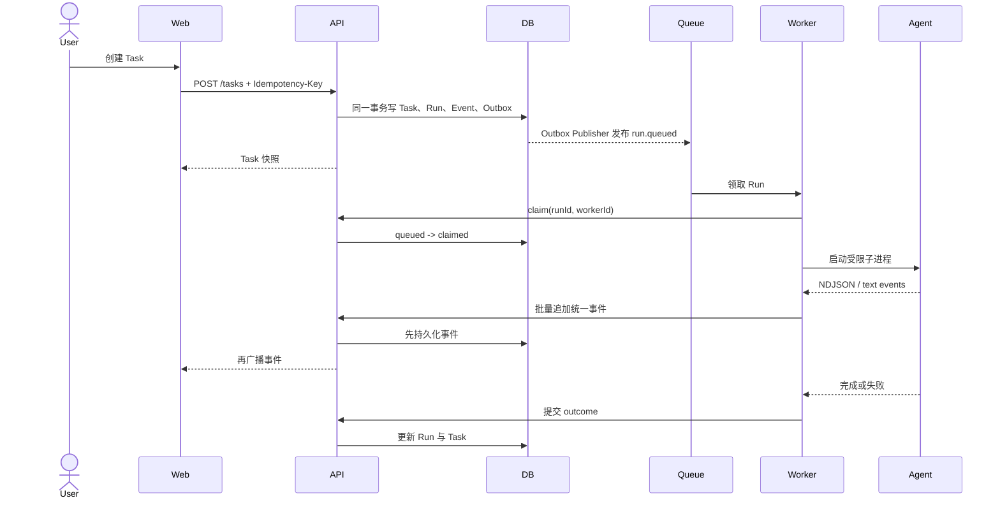

# 03. 系统架构

## 架构结论

MVP 使用“模块化单体 API + 独立 Worker”的结构。API 负责一致性、权限和事件持久化；Worker 负责队列消费与不可信 Agent 子进程；Web 只消费 API 和实时事件，不持有业务真相。

## 简洁性基线

状态：**Accepted。**

RelayHub 的目标不是通过增加服务数量证明架构能力，而是用尽可能少的组件清楚表达任务编排、Agent 隔离和可靠执行。MVP 到多 Agent 闭环完成前，保持以下约束：

- 应用进程只保留 Web、API 和 Worker；Orchestrator 是 API 内部模块，不独立部署。
- PostgreSQL 是唯一业务事实源；BullMQ job 只携带 `runId`；WebSocket 只负责已持久化事件的通知。
- Builder、Reviewer 是同一 Run/AgentProfile 模型上的角色，不为每个角色复制一套执行系统。
- 新 Agent 通过 `AgentAdapter` 接入，不为不同模型复制 Worker、队列或状态机。
- 领域模块可以拆文件和明确依赖，但不为每张表创建形式化 Repository、Service、DTO 和 Mapper 套件。
- 不引入微服务、事件溯源、CQRS、通用工作流 DSL 或插件框架，除非当前需求出现可验证的阻塞证据。
- 新功能必须先说明它属于现有哪个模块、修改哪个状态机、产生哪些持久事件；无法回答时不开始编码。

判断一次抽象是否值得保留，只看三个问题：是否消除了已经发生的重复，是否守住了进程或数据边界，是否让核心执行链更容易测试。仅仅为了“以后可能需要”的抽象不进入 MVP。

### 当前结构健康度

状态：**Implemented assessment（2026-08-07）。**

主链路仍可由一个人完整追踪：`Web -> API transaction/outbox -> BullMQ -> Worker -> Adapter -> persisted event`。基础设施数量虽然包含 PostgreSQL 和 Redis，但两者职责互不重叠，因此属于必要复杂度。

进入 Phase 3 前识别的两个增长点已经按最小范围处理：

- `apps/api/src/store.ts` 已从 578 行收敛为 98 行兼容门面；内部按 Workspace、Task、Run execution 和 Workflow transaction 拆到同一 API 包的 `persistence/` 目录。模块仍共享一个 PostgreSQL 连接和原事务边界，没有增加网络跳转、部署单元或通用 Repository 框架。
- Web 展示层已拆为约 200 行的 `page.tsx` 状态入口和独立 `dashboard.tsx` 组件；加入 Review/Finding UI 时继续复用现有固定壳层，不引入额外前端状态框架。

以上是按功能边界拆代码，不是增加部署单元或抽象层。拆分后的验收标准是入口文件变薄、事务边界仍清楚、端到端链路没有增加新的跳转层。

## 设计方法

状态：**Accepted。**

RelayHub 采用“整体设计、分层实现”，不是边写表边决定系统：

1. 先定义系统最终要解决的问题、边界和非目标。
2. 再定义稳定的领域对象、所有权、状态机和通信协议。
3. 再确定 PostgreSQL、Queue、WebSocket 和 Agent Runtime 各自承载哪些职责。
4. 最后按可运行纵向切片逐层实现，每一层都服从整体蓝图。

整体设计不等于一次性预测全部代码细节。它先固定难以随意改变的语义边界；部署规模、索引、缓存和可选字段可以根据验证结果继续演进。

```text
产品目标与边界
  -> 领域模型与状态机
  -> 命令、事件与所有权
  -> 目标架构与安全边界
  -> 数据模型和 API
  -> 分阶段纵向实现
```



## 组件职责

### Web Console

- Workspace、Agent 和 Task 管理。
- Task Timeline 与流式输出。
- 取消、重试、人工裁决。
- 不自行推断最终状态；以服务端快照为准。

### Control Plane API

- 命令校验、身份与 Workspace 边界。
- Task / Run / Handoff / Review 的事务写入。
- 状态机守卫和幂等处理。
- 查询快照、历史事件和健康状态。

### Orchestrator

- 根据 Task 和 Handoff 创建 Run。
- 控制 builder → reviewer 的流程。
- 保证目标 Agent 可用且没有形成循环交接。
- 根据 Review 结论推进 Task。

### Queue

- 解耦用户请求与长时间 Agent 执行。
- 提供领取、重试、延迟和并发限制。
- 队列不是最终状态来源；数据库中的 Run 才是。

### PostgreSQL、Queue 与 Handoff 的职责边界

状态：**Accepted target architecture。**

这三个组件不能互相替代：

| 组件 | 核心职责 | 不负责什么 |
|---|---|---|
| PostgreSQL | 保存 Task、Run、Handoff、Review 和审计事件，是可恢复事实来源 | 不直接唤醒 Agent，不承担实时界面推送 |
| Redis/BullMQ | 投递待执行 Run、并发控制、延迟和重试 | 不作为业务状态或历史真相源 |
| Handoff API | 表达 Agent A 要把什么工作、证据和验收要求交给 Agent B | 不直接共享 A 的隐藏推理或 B 的 Session |

因此 PostgreSQL 会是最终存储架构的一部分，但它本身不是 Agent 的聊天协议。它更像持久邮箱和档案库；Queue 是邮递员；Handoff 是信件内容。

PostgreSQL 和 Redis/BullMQ 都是正式运行架构的基础设施，不是二选一，也不是后期可有可无的优化。Phase 1A 的 HTTP 轮询只用于验证纵向链路；进入真实 Agent 前必须同时完成 PostgreSQL 事实层和 BullMQ 执行层。

Handoff 的目标写入顺序：

```text
Builder running
  -> 验证来源 Run、Task 配置与目标 AgentProfile
  -> 在同一事务写 pending Handoff + handoff.requested Event
Builder run.completed
  -> 在同一事务写 Builder Outcome + Reviewer 子 Run + dispatched Handoff + Outbox
  -> Outbox Publisher 投递 Queue
  -> Reviewer Worker 领取子 Run
```

Handoff 请求不会在 Builder 尚未完成时提前唤醒 Reviewer。即使 Queue 消息重复、过期或已经被消费，平台仍能从 PostgreSQL 还原谁在何时向谁交接了什么。

### Agent Worker

- 领取 Run 并原子认领执行权。
- 构造受限命令参数和工作目录。
- 管理子进程、取消信号、退出码和输出流。
- 将原始事件交给 Adapter 转换，再批量提交平台事件。

### Run execution token

状态：**Implemented（2026-08-06）。**

Worker 原子领取 Run 时，API 生成一个带 `rht_` 前缀的 256-bit 随机不透明 Token。领取响应将执行上下文和明文 Token 分开返回；数据库只保存 SHA-256 哈希、签发时间、过期时间和撤销时间。

- Token 只绑定领取到的单个 Run，不能用于另一个 Run。
- Worker 仅在进程内存中持有明文，并通过 Bearer header 访问该 Run 的 control 和 event 接口。
- `ClaimedRun` 执行上下文进入 AgentAdapter；`executionToken` 不进入 Agent 子进程、Prompt、Event、日志 payload 或公有 API。
- 默认有效期为 2 小时，可由 `RELAY_HUB_RUN_TOKEN_TTL_MS` 配置；Run 成功、失败、取消或丢失后必须失效，当前已在成功、失败和取消终态事务中立即撤销。
- 这是本地优先 MVP 的执行隔离，不是用户登录、RBAC 或多租户认证。claim 接口的 Worker 身份认证和 lease/heartbeat 属于后续可靠性边界。

### Workspace Bootstrap

状态：**Implemented（2026-08-06）。**

Bootstrap 是 Workspace 的项目环境契约，不属于 Codex、Claude Code、OpenCode 或任何特定 AgentAdapter。一个项目只需确认准备规则，多种 Agent 运行时共同复用：

```text
Workspace bootstrap policy
  -> Git worktree
  -> explicit command + argv steps
  -> prepared project environment
  -> selected AgentAdapter
```

- Workspace 保存显式 `BootstrapPolicy`；空步骤表示 `none`。
- Task 创建 Run 时把策略固化为 `bootstrapPolicySnapshot`，排队后的 Workspace 配置变化不会改变既有 Run。
- Worker 只在隔离 Worktree 内执行步骤，复用 ProcessSupervisor 的参数数组、环境变量白名单、超时、取消和输出限制。
- `run.bootstrap_*` 事件先持久化；任一步骤 spawn、超时或非零退出都会收敛为 `bootstrap_failed`，Agent 不启动。
- 项目语言或锁文件自动识别以后只能生成建议，不能在未经用户确认时执行安装命令。

机器上是否存在 Codex、Claude Code 或 OpenCode 属于 AgentProfile/Adapter health check；项目使用 Node、Python、Go 以及怎样准备依赖属于 Workspace。两者禁止混入同一个配置对象。

### AgentAdapter

- 隔离不同 CLI 的命令、事件协议和 Session 语义。
- 只产生平台统一事件，不直接修改 Task 状态。
- Mock Adapter 用于确定性演示；Codex CLI 与 OpenCode CLI Adapter 已分别使用各自的非交互 JSON/JSONL 协议实现。

Builder 与 Reviewer 是工作流角色，不绑定具体模型或供应商。AgentProfile 分别选择 Adapter、provider、model 和 tool policy。同一工作流可以使用 Codex Builder + Claude Reviewer，也可以使用其他组合。

AgentProfile 是用户定义的协作者身份，CLI/Adapter 只是它的运行载体。用户先命名 Agent、选择 `implement`/`review` 能力，再选择 Mock、Codex CLI 或 OpenCode CLI；CLI 专属字段由对应 Adapter schema 管理，不能反过来把“OpenCode”本身建模成 Agent。

AgentProfile 可以修改并被未来 Run 复用，但每个 Run 在创建事务中保存不可变 `agentProfileSnapshot`。Worker claim 只使用快照，不再读取 AgentProfile 当前值；因此排队后修改名称、CLI、模型或配置不会改变该 Run。Reviewer、repair Builder 等后续 Run 在各自创建时获取当时的最新 Profile，再独立固化。

OpenCode AgentProfile 使用精确的 `provider/model` 作为运行时模型标识，并可保存 variant、OpenCode agent 名称和凭证环境变量名称。API Key 值不进入 PostgreSQL、Run snapshot、Prompt 或 Timeline；用户可使用 `opencode providers login` 管理 OpenCode 自己的凭证。健康检测只验证 CLI 可启动且模型出现在本机 `opencode models` 目录，不发送计费请求，因此真实凭证只会在任务执行时验证。

**Implemented（2026-08-09）：** ProviderConnection 已从 AgentProfile 中独立出来并归 Workspace 所有。官方连接复用 CLI 登录；自定义连接集中保存 OpenAI Chat Completions / Responses 协议、Base URI、凭证环境变量名称和模型目录。Agent 只引用连接并选择模型。Worker 将连接快照转换为单次 OpenCode 内联配置，因此所有智能执行仍发生在 Agent CLI，RelayHub 只承担控制面职责。旧的直接 `provider/model` Agent 配置保持兼容。

**Implemented（2026-08-09）：** ProviderConnection 具备独立管理生命周期。连接身份（类型与 CLI）创建后不可变；名称、状态和自定义 API 配置可更新。服务端在停用连接或移除模型前检查启用 Agent 引用，避免集中配置产生级联失效。默认诊断不产生模型费用；显式 live 检测经用户费用确认后，通过 OpenCode 向第一个配置模型发送固定测试文本。

OpenCode Adapter 仍服从统一 Worktree 和角色边界：Builder 可以在当前 Worktree 内编辑和执行命令；Reviewer 通过每次 Run 注入的高优先级配置禁用 `edit`、`bash`、`external_directory`、`question` 和子 Agent `task` 权限。两者都使用 `--pure`、JSON 事件流和显式工作目录，不共享 Session 或隐藏推理。

Codex Reviewer 使用 RelayHub 注入的命名 permission profile，将文件权限与网络权限拆开：Builder Worktree 继承 `:read-only`，仅允许 `localhost` / `127.0.0.1` 的 sandboxed network 和本地监听，用于独立复跑需要临时服务的测试。外部网络和非回环监听不开放；Builder 与 repair Run 仍使用 `workspace-write`。该边界由 Adapter 启动参数强制，不依赖 Prompt 或用户级 Codex 配置。

**Accepted（2026-08-09，尚未实现）：** RelayHub 只编排平台级 Agent；CLI 内部子 Agent 的任务拆分、数量和协作方式由主 Agent 自己控制。内部子 Agent 不是 `AgentProfile` 或独立 `Run`，没有自己的 Run Token、Handoff 或 Review authority，只能在父 Run 的权限和生命周期内工作。第一版平台配置只需要 `internalSubagents = deny | allow`；需要独立责任、权限或长期状态的子任务必须由 RelayHub 创建新的平台 Run。

ReviewPolicy 可以配置：

- Reviewer 必须与 Builder 使用不同 AgentProfile；
- 是否进一步要求不同 provider 或 model family；
- 无符合条件 Reviewer 时是阻塞、降级还是请求用户选择。

### Realtime Gateway

- 按 Task 房间广播已持久化事件。
- 每条事件携带数据库事件 ID。
- 客户端发现缺口后走 HTTP 补拉，不依赖 WebSocket 重放全部历史。

## 领域模块

```text
control-plane/
├── workspace
├── agents
├── tasks
├── runs
├── handoffs
├── reviews
├── orchestration
├── audit-events
└── realtime

worker/
├── queue-consumer
├── process-supervisor
├── adapters
│   ├── mock
│   ├── codex
│   └── opencode
└── event-reporter
```

模块可以共处一个仓库和少量进程，但禁止跨模块直接修改别人的表；通过应用服务调用并在一个事务中完成需要一致性的变更。

## 关键执行时序



## 状态一致性策略

### 命令与事件

- 命令表达意图，例如“取消 Run”。
- 事件表达已经发生的事实，例如“子进程退出且已回收”。
- `cancel_requested` 可以立即记录，但只有 Worker 确认后才进入 `cancelled`。

### 事务边界

创建 Task 时，在同一数据库事务内写入：

1. Task。
2. 初始 Run。
3. 审计事件。
4. Outbox 记录。

后台 Publisher 将 Outbox 投递到队列，避免“数据库成功但队列消息丢失”。

### 乐观并发

Task 与 Run 带 `version`。更新语句包含旧版本条件，受影响行数为 0 时说明有并发更新，调用方重新读取后决定重试或拒绝。

## 失败场景与处理

| 场景 | 处理 |
|---|---|
| 队列消息重复 | Worker claim 使用唯一 Run ID 和状态条件，重复消息直接确认 |
| Worker 在 claim 后崩溃 | lease 到期后由 reconciler 标记 `worker_lost` 并按策略重试 |
| Agent 输出非法 JSON | 记录 `protocol_error`，保留受限原始片段用于诊断 |
| Agent 长时间无输出 | 结合进程存活和可配置超时判断，不把 stderr 当作有效进度 |
| WebSocket 断线 | 使用最后 event ID 通过 HTTP 补拉 |
| Handoff 形成循环 | 限制最大深度并检测祖先 Agent/Run 链 |
| API 写成功但队列失败 | Outbox Publisher 重试 |
| 用户重复点击 | Idempotency-Key 返回首次命令结果 |

## 安全边界

- 子进程使用参数数组启动，禁止拼接 shell 字符串。
- Workspace 根目录先 `realpath`，所有文件路径必须保持在根目录下。
- Agent 运行使用最小权限与显式工具策略。
- callback token 只绑定单次 Run，并设置有效期。
- 日志统一脱敏 API key、token、cookie 和环境变量。
- WebSocket 房间由服务端授权，客户端不能任意加入其他 Workspace。
- MVP 默认单用户本地模式，但身份字段和 ownership 从一开始保留。

## 技术栈建议

| 层 | 选择 | 原因 |
|---|---|---|
| 语言 | TypeScript | 前后端共享类型，适合 CLI 与流式事件处理 |
| Web | Next.js + React | 快速构建操作台与任务 Timeline |
| API | Fastify | 轻量、Schema 友好、WebSocket 生态成熟 |
| 数据库 | PostgreSQL + Drizzle ORM | 事务、约束、可读 SQL 和迁移能力 |
| 队列 | Redis + BullMQ | 长任务、重试、并发和延迟任务 |
| 实时通信 | Socket.IO | 房间、重连和事件模型易于演示 |
| 校验 | Zod | API、队列与 Adapter 边界统一校验 |
| 测试 | Vitest + Testcontainers | 单元测试与真实数据库/Redis 集成测试 |

实施分两步：Phase 1A 先用可替换的本地 Store 和领取端口验证纵向切片；Phase 1B 已在真实 CLI 之前同时切换到 PostgreSQL、Transactional Outbox 和 Redis/BullMQ。

### 当前实现状态

Phase 1B 已用 PostgreSQL Repository 替换 JSON Store，并用 BullMQ 消费替换 Worker HTTP 短轮询。创建任务的事务同时写入 Task、Run、首个 RunEvent 和 Outbox；Publisher 成功投递后才把 Outbox 标为 `published`。

Queue job 只携带 `runId`。Worker 收到消息后仍需通过 PostgreSQL 条件更新完成 `queued -> claimed`，所以重复 job 只能有一个获得执行权。Phase 1A JSON 文件保留为旧数据备份，并提供幂等导入命令，不再是运行真相源。

Phase 2 已加入 Codex CLI Adapter。Worker 为真实写入任务创建独立 Git Worktree，以参数数组启动 `codex exec --json --sandbox workspace-write`，把公开 JSONL 事件转换为统一 AgentEvent。模型 reasoning 不进入 RelayHub Event；thread ID、命令摘要、文件变化、最终消息和终态进入 PostgreSQL。Worktree 在任务结束后保留，用户确认前不自动清理。

Phase 2.5 已实现首个确定性 Orchestrator seam：`run.completed` 只把 Run 收敛为 `succeeded` 并保存结构化 `RunOutcome`，不再直接完成 Task。未配置或未产生 Handoff 时，Task 仍进入 `waiting_for_user`；存在合法 pending Handoff 时，Phase 3.1 已通过同一决策入口改为 `reviewing` 并创建 Reviewer Run。`CompletionPolicy` 只允许在后续合法 Review verdict 之后执行。

Phase 2.6 已实现 Workspace Bootstrap。策略与 Agent provider 解耦并在 Run 创建时固化；Worker 在真实 AgentAdapter 启动前执行准备步骤，失败时记录结构化事件并阻断 Agent。当前显式 API 配置是事实来源，项目语言/锁文件探测尚未实现。

Phase 2.7 已实现轻量单次 Run execution token。Worker 领取时获得一次明文凭证，API 只保存哈希并保护 control/event 回调；终态事务撤销凭证。它防止重复投递、旧 Worker 或错误进程跨 Run 上报，但不替代未来的 Worker 注册、lease 和 heartbeat。

Phase 2.8 已完成 API 持久化职责整理。`PostgresStore` 保留为路由层稳定门面，Task 创建与查询、Run 领取/Token/取消、Agent Event 驱动的 Workflow transaction 以及 Workspace 配置分别由同包模块实现。此拆分只缩短文件和明确依赖，不改变数据库 schema、HTTP 合约、状态机或部署结构。

Phase 3.1 已实现最小结构化 Handoff。用户在 Task 创建时选择独立 Reviewer AgentProfile；Builder Adapter 在完成前提交 objective、context summary、artifact refs 和 acceptance criteria。API 先持久化 pending Handoff，Builder 成功后再原子创建 `triggerType=review` 的父子 Run、更新 Task=`reviewing` 并写 Outbox。Reviewer 领取时只获得 Task、自己的 AgentProfile、Handoff 和继承的 Builder Worktree；真实 Codex Reviewer 使用文件只读、仅允许回环本地验证的 permission profile，并跳过写入型 Bootstrap。

Phase 3.2 已实现 Review 裁决边界。Reviewer 先提交不可变 `Review + Findings`，API 校验 Run 角色、Task Reviewer 身份、verdict 与 Finding 严重度的一致性；Reviewer `run.completed` 只有在 Review 已持久化后才能成功。随后 Orchestrator 在同一事务中应用 CompletionPolicy：`auto_on_approval` 直接完成，`require_user_confirmation` 等待用户确认，`risk_based` 仅在 Builder 存在非空且全部成功的命令证据时自动完成。

Phase 3.3 已实现最小自动返工循环，没有引入通用工作流引擎：

```text
Review #N changes_requested
  -> Task reviewing -> changes_requested -> queued
  -> 创建 triggerType=retry 的 Builder Run
  -> 注入来源 Review + Findings
  -> Builder 在继承 Worktree 中修复并提交新 Handoff
  -> 创建 Review #(N+1)
```

Task 固定保存最初 Builder AgentProfile；每一轮执行者仍由 Run 独立记录。返工 Run 的 `parentRunId` 指向触发它的 Reviewer Run，`retryOfRunId` 指向上一轮 Builder Run，因此数据库可以重建完整因果链。返工继承已经准备好的 Worktree，不重复创建分支或执行 Bootstrap。`maxReviewRounds` 默认 3、范围 1–10；达到预算后不再排队新 Run，Task 进入 `waiting_for_user` 并记录 `task.repair_limit_reached`。
