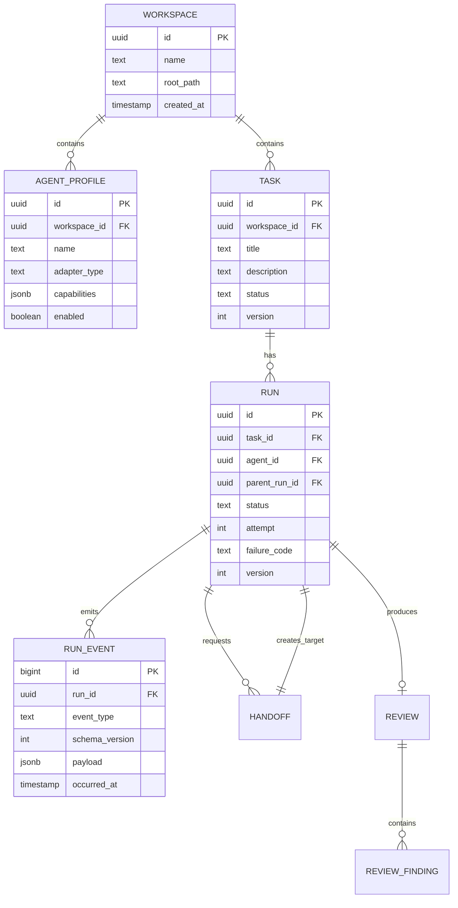

# 04. 数据模型与 API 草案

## 设计状态

当前内容是目标领域模型的第一版草案，不是不可修改的最终数据库定义。PostgreSQL schema 必须从整体领域设计推导，并通过 migration 演进。

状态：**Accepted；Phase 1B schema baseline 已通过 Drizzle migration 实现。**

## 哪些定义应当长期稳定

以下内容会被 API、Worker、Web、Handoff 和审计共同引用，因此应尽早稳定：

- 核心实体：Workspace、AgentProfile、Task、Run、RunEvent、Handoff、Review。
- 全局身份：每个实体的 ID 以及 Workspace ownership。
- 因果关系：Task → Run、parentRun → childRun、Handoff → targetRun。
- Task 与 Run 的状态语义和终态规则。
- 事件的顺序、来源、发生时间、去重键和 schema version。
- “数据库是事实来源，Queue 不是事实来源”的所有权边界。
- Agent 只能通过显式 Handoff 传递工作，不能共享隐藏推理。

这些定义可以增加新能力，但不应在实现中随意改名或改变含义。

## 哪些字段允许演进

以下字段预计会随着真实 Agent、可观测性和多 Agent 工作流继续变化：

- Adapter/provider 的特定配置。
- Agent capabilities 和工具策略。
- 失败诊断、Token、成本与性能指标。
- Handoff artifact 的具体类型。
- Review finding 的扩展信息。
- UI 展示字段和非关键 metadata。
- 为真实查询增加的索引、物化视图或缓存字段。

字段变化通过 migration 完成。优先采用向后兼容的“先增加、迁移数据、切换读写、再移除”流程，避免一次变更同时破坏 API、Worker 和历史事件。

## Schema 演进规则

1. 核心 ID、ownership 和因果引用使用明确列与外键，不藏在 JSON 中。
2. 业务状态由 check constraint 和应用状态机共同约束。
3. `run_events` 作为历史事实默认只追加，不原地改写旧事件。
4. Event payload 带 `schema_version`，消费者必须显式处理支持的版本。
5. 高频筛选和一致性字段使用普通列；供应商特定、低稳定性信息才进入 JSONB。
6. Migration 必须有升级验证；涉及删除或不可逆转换时，需要单独 ADR。
7. SQL schema 服务于领域模型，不允许为了 ORM 方便改变业务语义。

## 核心实体关系



## 表设计要点

### `workspaces`

| 字段 | 说明 |
|---|---|
| `id` | UUID |
| `name` | 展示名称 |
| `root_path` | 规范化后的允许工作目录 |
| `bootstrap_policy` | provider-neutral 项目环境准备步骤；空步骤表示 `none` |
| `created_at`, `updated_at` | 审计时间 |

### `agent_profiles`

| 字段 | 说明 |
|---|---|
| `adapter_type` | `mock`、`codex_cli` 或 `claude_cli` |
| `model_label` | 仅作展示与诊断，不参与安全判断 |
| `capabilities` | 例如 `implement`、`review`、`research` |
| `config` | 非敏感配置；密钥只保存环境变量引用名 |
| `enabled` | 停用后不能创建新 Run |

约束：同一 Workspace 内 Agent 名称唯一。

### `tasks`

除基本字段外保存：

- `acceptance_criteria jsonb`
- `requested_by`
- `current_run_id`
- `reviewer_agent_id`: 用户为该 Task 选择的独立 Reviewer AgentProfile；可空以兼容单 Builder 流程
- `version`
- `completed_at`

状态由数据库 check constraint 限制在枚举集合内。

### `runs`

关键字段：

- `task_id`, `agent_id`, `parent_run_id`
- `trigger_type`: `user`、`handoff`、`review`、`retry`
- `status`, `attempt`, `version`
- `worker_id`, `lease_expires_at`
- `execution_token_hash`, `token_issued_at`, `token_expires_at`, `token_revoked_at`: 单次 Run 执行凭证的哈希和生命周期；不保存明文
- `session_ref`: Adapter 的可恢复会话标识
- `failure_code`, `failure_detail`
- `outcome jsonb`: 成功 Run 的结构化执行结果，包含摘要与实际命令证据；不等同于 Task 验收通过
- `started_at`, `finished_at`
- `workspace_root`: 创建 Run 时固化的执行 Workspace 快照
- `bootstrap_policy_snapshot`: 创建 Run 时固化的准备策略，避免排队期间配置漂移
- `worktree_path`, `working_directory`, `branch_name`: 隔离执行与人工检查入口

重试创建新行，而不是把失败行改回 queued。

### `run_events`

这是执行时间线的持久事实：

- `id bigint generated always as identity`
- `run_id`
- `event_type`
- `schema_version`
- `payload jsonb`
- `source`: `api`、`worker`、`agent`、`user`
- `occurred_at`
- `dedupe_key`

唯一约束 `(run_id, dedupe_key)` 防止 Worker 重发导致重复事件。

### `handoffs`

- `source_run_id`
- `target_agent_id`
- `objective`
- `context_summary`
- `artifact_refs jsonb`
- `acceptance_criteria jsonb`
- `target_run_id`
- `status`

`source_run_id` 唯一，当前一个 Builder Run 最多产生一个 Handoff。`pending` 表示交接事实已保存但 Builder 尚未完成；`dispatched` 表示 Reviewer 子 Run 与 Outbox 已在同一事务中创建，不表示 Review 已通过。

### `outbox_events`

- 与 Task、Run 和首个 Event 在同一 PostgreSQL 事务写入。
- `event_type = run.queued`，payload 只保存通过 Zod 校验的 `runId`。
- Publisher 成功写入 BullMQ 后标记 `published`；失败保留 `last_error`、`attempts` 与下次可用时间。
- BullMQ `jobId` 使用 Outbox ID，使“已投递但尚未标记 published”后的重试仍可去重。

### `reviews` 与 `review_findings`

Review 保存总体结论和摘要；Finding 保存：

- `severity`: `blocking`、`should_fix`、`suggestion`
- `file_path`, `line_start`, `line_end`
- `title`, `detail`, `suggestion`

## HTTP API

### Workspace 与 Agent

```http
POST   /api/workspaces
GET    /api/workspaces/:workspaceId
POST   /api/workspaces/:workspaceId/agents
GET    /api/workspaces/:workspaceId/agents
POST   /api/agents/:agentId/health-check
PATCH  /api/agents/:agentId
```

### Task 与 Run

```http
POST   /api/workspaces/:workspaceId/tasks
GET    /api/tasks/:taskId
GET    /api/tasks/:taskId/events?after=:eventId
POST   /api/tasks/:taskId/cancel
POST   /api/tasks/:taskId/confirm
POST   /api/runs/:runId/retry
POST   /api/runs/:runId/cancel
GET    /api/workspaces
PATCH  /api/workspaces/:workspaceId
GET    /api/workspaces/:workspaceId/agents
```

创建、取消和重试命令要求 `Idempotency-Key` 请求头。

### Worker 内部接口

```http
POST   /internal/runs/:runId/claim
POST   /internal/runs/:runId/heartbeat
POST   /internal/runs/:runId/events
POST   /internal/runs/:runId/outcome
POST   /internal/runs/:runId/handoffs
POST   /internal/runs/:runId/reviews
```

内部接口使用单次 Run token，服务端根据 token 解析 run、agent 和 workspace，不接受客户端自行声明这些身份。

Phase 2.7 当前实现的最小闭环为：

```http
POST /internal/runs/:runId/claim
  -> { claimed: ClaimedRun, executionToken: string }

GET  /internal/runs/:runId/control
POST /internal/runs/:runId/events
Authorization: Bearer rht_<opaque-random-token>
```

claim 只在 `queued -> claimed` 的原子更新成功时返回一次明文 Token。control/event 根据 URL 中的 Run ID 查询该 Run 的哈希，再校验 Token、过期时间、撤销时间和非终态状态；不接受请求体自报 agentId、taskId 或 workspaceId。缺失、错误、过期、跨 Run 或已撤销凭证统一返回 `401 invalid_run_token`。claim 自身的 Worker 身份认证尚未实现，当前仍位于单机内部信任边界；后续与 Worker lease/heartbeat 一起补齐。

Phase 3.1 中 `handoff.requested` 继续通过受 Run Token 保护的 event 接口提交，不新增旁路 Handoff API。服务端要求目标 ID 与 Task 的 `reviewer_agent_id` 一致、目标 AgentProfile 启用且具有 `review` capability，并拒绝 Builder 把工作交给自己。Reviewer Run 通过既有 claim 接口获得持久化 Handoff；Queue job 仍只携带 `runId`。

Phase 3.2 中 `review.submitted` 继续复用同一个受 Token 保护的 event 接口。只有 `trigger_type=review` 且 AgentProfile 与 Task `reviewer_agent_id` 一致的 Run 可以提交；每个 Reviewer Run 只能保存一个 Review，同一 Task 的 round 唯一。`approved` 不能包含 blocking/should_fix Finding，`changes_requested` 至少包含一条 actionable Finding，`blocked` 至少包含一条 blocking Finding。Reviewer 必须先提交 Review，再提交 `run.completed`。

## 统一 Agent 事件

```ts
type AgentEvent =
  | { type: 'run.prepared'; worktreePath: string; workingDirectory: string; branchName: string }
  | { type: 'run.bootstrap_started'; stepCount: number }
  | { type: 'run.bootstrap_step_completed'; stepIndex: number; name: string; command: string }
  | { type: 'run.bootstrap_completed'; stepCount: number; durationMs: number }
  | { type: 'run.bootstrap_failed'; stepIndex: number; code: BootstrapFailureCode; message: string }
  | { type: 'run.started'; sessionRef?: string }
  | { type: 'output.delta'; text: string }
  | { type: 'tool.called'; callId: string; name: string; inputSummary: unknown }
  | { type: 'tool.completed'; callId: string; outputSummary?: unknown }
  | { type: 'handoff.requested'; handoff: HandoffDraft }
  | { type: 'review.submitted'; review: ReviewDraft }
  | { type: 'run.completed'; outcome: RunOutcome }
  | { type: 'run.cancelled'; reason?: string }
  | { type: 'run.failed'; code: FailureCode; message: string };
```

Adapter 事件先经过 Zod 校验，再进入平台。无法识别的供应商事件可记录为诊断数据，但不能直接推进业务状态。

Workspace Bootstrap 在 `run.prepared` 与 `run.started` 之间产生 `run.bootstrap_started`、`run.bootstrap_step_completed`、`run.bootstrap_completed` 或 `run.bootstrap_failed`。失败后紧接 `run.failed(code=bootstrap_failed)`；因此“环境准备失败”和“Agent 执行或测试失败”具有不同机器语义。

`RunOutcome` 当前包含执行摘要和命令证据（命令、退出码、状态和受限输出摘要）。它属于 Run 的执行事实；即使命令失败后 Agent 协议正常结束，Run 仍可以是 `succeeded`，但 Task 不能因此自动变成 `completed`。验收结论必须由后续 Reviewer verdict、CompletionPolicy 或人工裁决产生。

Builder 的 `handoff.requested` 必须发生在 `run.completed` 之前。前者只创建 pending Handoff，不改变 Task owner 或创建子 Run；后者成功时才由 Orchestrator 在同一事务中创建 Reviewer Run、写 Outbox、把 Handoff 标记为 dispatched，并将 Task 切换为 reviewing。Reviewer 完成不会递归创建另一个 Reviewer。

Reviewer 的 `review.submitted` 同样先保存事实而不立即结束 Run。Reviewer `run.completed` 事务读取已保存 Review，并根据 verdict 与 CompletionPolicy 原子推进 Task。`POST /api/tasks/:taskId/confirm` 只接受处于 `waiting_for_user` 且最新 Review 为 `approved` 的 Task；重复确认已完成 Task 是幂等读取。

## WebSocket 事件

服务端事件统一使用 envelope：

```ts
interface RealtimeEnvelope<T> {
  eventId: number;
  workspaceId: string;
  taskId: string;
  runId?: string;
  type: string;
  occurredAt: string;
  data: T;
}
```

首版需要：

- `task.updated`
- `run.updated`
- `run.output.delta`
- `run.tool.called`
- `handoff.created`
- `review.submitted`
- `system.warning`

## 状态迁移接口约束

应用层只暴露语义方法，不允许调用方直接赋值状态：

```ts
claimRun(runId, workerId)
markRunStarted(runId, sessionRef)
requestCancellation(runId, actor)
completeRun(runId, outcome)
failRun(runId, failure)
createHandoff(sourceRunId, draft)
submitReview(runId, review)
```

每个方法完成四件事：校验当前状态、执行业务写入、追加审计事件、写 Outbox。
