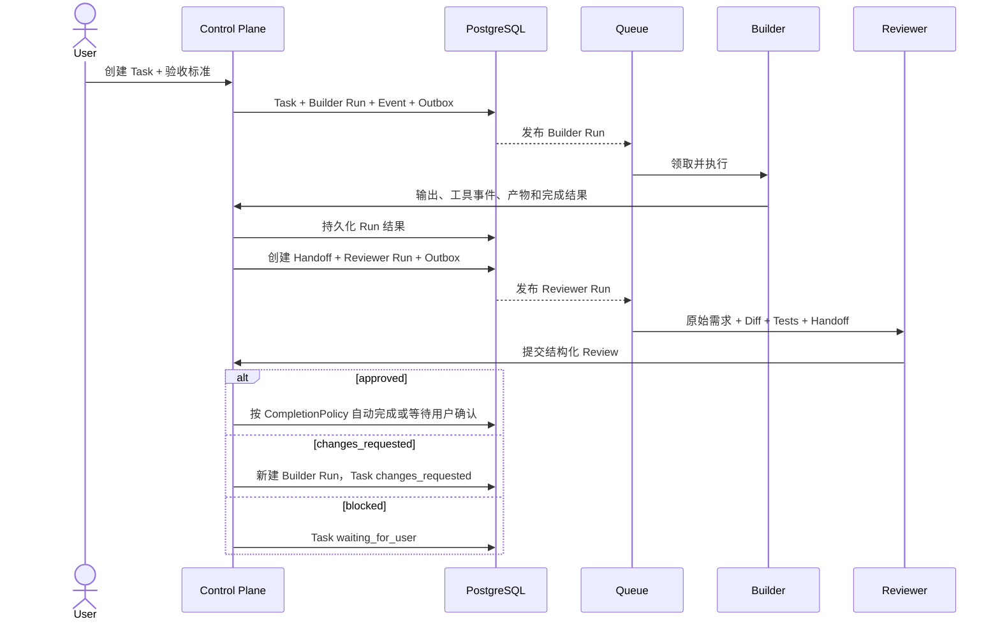
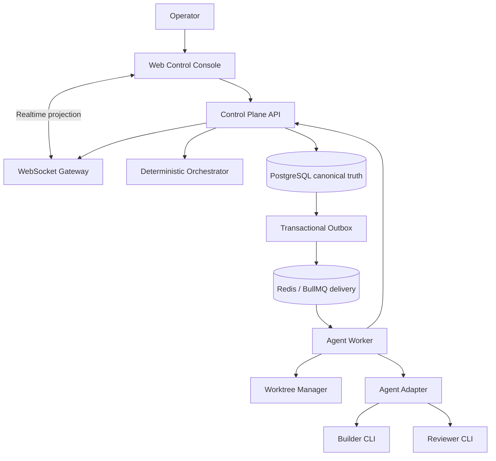

# 09. RelayHub 整体设计基线草案

- 状态：Accepted
- 日期：2026-08-06
- 目的：在 PostgreSQL schema 和真实 Agent Adapter 实现前，先确定稳定的产品、领域与架构边界。

## 参考结论

本基线参考 Clowder AI 的以下经验，但按个人简历项目范围重新设计：

- [协同全景](../../docs/architecture/collaboration-landscape.md)：TeamAct 主循环、责任流转、证据和裁决。
- [用户旅程](../../docs/architecture/user-journeys.md)：用户只处理目标与关键决策，平台负责执行过程。
- [CLI 集成](../../docs/architecture/cli-integration.md)：异构 Agent Adapter、流式事件和进程生命周期。
- [结构化 A2A 路由](../../docs/features/F055-a2a-mcp-structured-routing.md)：结构化目标优先于文本 `@mention`。
- [Identity / Session ownership](../../docs/architecture/ownership/cells/identity-session.md)：Agent、Runtime Session、用户和消息身份不能混成一个概念。
- [Dispatch / Queue ownership](../../docs/architecture/ownership/cells/dispatch.md)：Queue 负责调度，durable execution record 负责历史真相。
- [Memory overview](../../docs/architecture/memory-system-overview.md)：事实、索引、提示和反馈必须分层。

RelayHub 不复制 Clowder AI 的猫人格、陪伴体验、完整记忆体系和大规模治理。它只保留对“可靠多 Agent 开发协作”必要的部分。

---

## 1. RelayHub 最终解决什么问题？

### 问题

开发者同时使用多个 Agent 时，仍然充当人工控制平面：

- 在多个窗口之间复制上下文。
- 决定下一步该唤醒哪个 Agent。
- 追踪谁正在执行、等待、失败或已经完成。
- 把 Builder 的产物整理后再交给 Reviewer。
- 在进程、页面或会话重启后重新拼接工作状态。

### 产品定义

RelayHub 是一个面向软件开发任务的多 Agent 协作控制平面：

> 用户定义目标和验收标准；Agent 独立执行与审查；平台负责身份、状态、调度、交接、恢复和审计。

RelayHub 不负责替模型推理，也不把多个模型融合成一个“大脑”。它让独立 Agent 在明确契约下组成可观察、可恢复的团队。

### 第一目标用户

- 单用户、本地优先的软件开发者。
- 已经使用 Codex、Claude Code 等 Agent CLI。
- 希望把多个独立 Agent 组织成可靠开发流程。

这里的“单用户、本地优先”表示：

- 第一版只有一个人类 Operator，不先做注册、团队成员、RBAC 和租户计费。
- Control Plane、Worker、PostgreSQL 和 Redis 默认运行在用户自己的电脑或用户控制的开发环境。
- Agent 操作本地仓库，数据默认不上传 RelayHub 自建云端。
- 可以同时拥有多个 Agent、多个模型、多个 Workspace 和多个并发 Task；“单用户”不等于“单 Agent”。

为了保留未来扩展空间，核心数据仍带 ownership/workspace 边界，但第一版不实现完整多租户产品。

### 核心价值

1. **减少人工路由**：用户不再手工搬运上下文。
2. **保留独立判断**：Reviewer 不继承 Builder 的隐藏推理。
3. **让执行可恢复**：任务状态不依赖浏览器或某个 CLI 进程存活。
4. **让协作可证明**：每次交接、审查和状态变化都有来源与证据。

---

## 2. 各角色分别负责什么？

### Operator（用户）

负责：

- 提出目标、约束和验收标准。
- 选择或确认工作流。
- 处理需要人类判断、权限或不可逆操作的决策。
- 对最终结果接受、退回或取消。

不负责：

- 手动在 Agent 之间复制信息。
- 维护 Run 状态或判断 Worker 是否仍然存活。
- 为每一次内部交接选择底层传输方式。

### Builder Agent

负责：

- 理解任务并执行实现。
- 产生代码、测试、命令结果和实现摘要。
- 在完成、阻塞或需要审查时提交结构化结果。

不负责：

- 直接修改平台中的 Task 状态。
- 直接启动 Reviewer 的模型会话。
- 把自己的隐藏推理当成可审计证据。

### Reviewer Agent

负责：

- 根据原始需求、代码差异和验证证据独立审查。
- 产生结构化 Review 和 Findings。
- 给出 `approved`、`changes_requested` 或 `blocked` 结论。

默认只读。Reviewer 不应和 Builder 共享同一个 Session，也不应仅依据 Builder 的总结作判断。

Builder 和 Reviewer 是角色，不是模型名称。每个 AgentProfile 可以选择自己的 Adapter、provider 和 model。ReviewPolicy 默认要求不同 AgentProfile，并允许进一步配置“必须不同 provider/model family”。

### Orchestrator（确定性平台模块）

负责：

- 根据显式状态和工作流规则创建 Run、Handoff 和 Review。
- 决定任务是否进入审查、返工、等待或终态。
- 执行循环深度、重试、并发和权限规则。

它不是另一个自由推理 Agent。核心状态迁移必须由确定性代码完成，不能依赖模型自由文本猜测。

### Agent Worker

负责：

- 领取 Run。
- 创建受限工作目录或 Git worktree。
- 启动、监控、取消和回收 Agent CLI 子进程。
- 将供应商事件转换后上报平台。

### Agent Adapter

负责：

- 供应商命令构造。
- NDJSON、JSON 或文本协议解析。
- Session start/resume/cancel 差异。
- 原始事件到统一 AgentEvent 的转换。

Adapter 不拥有 Task、Handoff 或 Review 状态。

---

## 3. 一个任务从创建到结束经历什么？

RelayHub 借鉴 TeamAct，但收敛为六步协作循环：

```text
State      当前任务处于什么状态？
Owner      现在由用户、Builder、Reviewer 还是平台负责？
Action     当前责任人执行什么动作？
Evidence   产生了什么代码、测试、日志或结构化结果？
Verdict    证据是否满足验收与审查标准？
Route      完成、返工、等待，还是交给下一个 Agent？
```

### 标准 Builder → Reviewer 流程



### 失败路径

- 单次 Run 失败不自动等于 Task 失败。
- 可重试错误创建新的 Run attempt，旧 Run 保持终态不变。
- 重试预算耗尽后，Task 进入 `failed` 或 `waiting_for_user`。
- Worker 丢失通过 lease 和 reconciliation 收敛为 `lost`，不能永久停在 running。
- 用户取消先记录 `cancel_requested`；只有执行回收完成后 Run 才进入 `cancelled`。

---

## 4. Agent 如何隔离、保持身份并相互通信？

### Agent 隔离

| 维度 | 基线 |
|---|---|
| 身份 | 每个 Agent 有独立 AgentProfile、Adapter、模型标签和工具策略 |
| Session | Session scope = workspace + agent + task/thread；不能恢复别的 Agent Session |
| Invocation | 每次 Run 有独立 token、有效期、幂等键和执行身份 |
| 并发 | 同一个可恢复 Session 单飞；重复 resume 必须排队或拒绝 |
| 文件 | 每个写入型 Run 使用独立 Git worktree；Reviewer 默认只读 |
| 上下文 | Agent 只获得本 Run 被授权的任务、事件、Handoff 和知识 |
| 失败 | 子进程失败由 Worker 收敛，不跨 Agent 传播运行时状态 |

### 身份连续性

平台不保存模型隐藏推理。Agent 的连续性来自：

1. 每次 Run 注入稳定 AgentProfile 和平台规则。
2. 在同一 scope 内恢复自己的 provider sessionRef。
3. Session 失效或过长后，注入显式摘要、Task 状态和自我 Handoff。
4. 只从已授权的持久事实中检索上下文。

### Agent 间通信

Agent 不能直接进入另一个 Agent 的 Session。唯一标准工作交接是结构化 Handoff：

```text
sourceRunId
targetAgentId
objective
contextSummary
artifactRefs
acceptanceCriteria
```

执行顺序必须是：

```text
验证来源 Run
-> 持久化 Handoff + Event + Outbox
-> Queue 投递目标 Run
-> 目标 Agent 使用自己的身份与 Session 执行
```

自然语言 `@reviewer` 可以作为 UI 便利语法，但必须先转换并确认成结构化 Handoff，不能直接成为状态迁移依据。

---

## 5. 哪些数据是长期事实，谁有权修改？

### Canonical ownership

| 数据 | 真相源 | 谁能改变 |
|---|---|---|
| Workspace / AgentProfile | PostgreSQL | 用户或受权管理 API |
| Task 状态 | PostgreSQL | Task application service 按状态机改变 |
| Run 生命周期 | PostgreSQL | Worker 命令 + Run application service |
| RunEvent / AuditEvent | PostgreSQL append-only log | 受权 API 只追加 |
| Handoff | PostgreSQL | 来源 Run 提议，平台验证和投递 |
| Review / Finding | PostgreSQL | 被授权 Reviewer Run 提交 |
| Queue delivery | Redis/BullMQ | Queue/Worker；不是业务真相 |
| provider sessionRef | PostgreSQL 中的运行引用 | 对应 Adapter/Worker 更新 |
| 代码产物 | Git commit/worktree | 写入型 Agent；平台保存引用 |
| 实时 UI | WebSocket projection | 只展示，不拥有事实 |
| 长期知识 | 后续 KnowledgeEntry | 用户确认或明确规则批准 |

### 事实层级

```text
用户需求与验收标准
    + Git/测试等机器证据
    + 结构化 Agent 产出
            ↓
平台状态与审计事实
            ↓
可重建的 Queue、WebSocket、搜索和 UI 投影
```

模型说“完成了”只是一项候选结果。只有平台收到合法终态事件，并按规则验证必要证据后，Run 或 Task 才能完成。

---

## 6. 哪些状态必须存在，哪些是终态？

### Task

建议状态：

```text
draft
  -> queued
  -> running
  -> reviewing
  -> completed

running/reviewing
  -> changes_requested -> queued
  -> waiting_for_user -> queued/cancelled
  -> failed
  -> cancelled
```

终态：`completed`、`failed`、`cancelled`。

从 `failed` 继续工作需要显式 reopen；reopen 创建新的 Run，不改写旧 Run 历史。

### Run

```text
queued -> claimed -> starting -> running
running -> succeeded | failed | cancelling | lost
cancelling -> cancelled | failed
```

终态：`succeeded`、`failed`、`cancelled`、`lost`。

终态 Run 永不重新进入 running；重试永远创建新 Run，并通过 `retryOfRunId` 建立因果关系。

### Handoff

```text
pending -> accepted -> dispatched
pending -> rejected | cancelled | expired
```

`dispatched` 只表示目标 Run 已创建并进入可靠投递，不表示目标工作已经完成。工作结果由 target Run 表达。

### Review

Review submission 是不可变记录，结论为：

- `approved`
- `changes_requested`
- `blocked`

新的审查轮次创建新的 Review，不覆盖上一轮结论。

### CompletionPolicy

Task 完成行为可由 Workspace 默认值和 Task override 配置：

- `auto_on_approval`
- `require_user_confirmation`
- `risk_based`

`risk_based` 根据明确、可测试的风险条件决定是否需要用户确认，不能让模型自由决定自己是否需要审批。

---

## 7. 第一版明确不做什么？

为了让个人项目能够真正完成，以下内容不进入第一版：

- 人格陪伴、游戏、语音和社交关系系统。
- 自动学习用户品味或自动修改 AgentProfile。
- 完整 RAG、向量数据库和主动记忆系统。
- Agent 群体投票、开放式 swarm 和无限自治。
- 同时支持所有 Agent CLI；先完成一个 Builder Adapter 和一个 Reviewer Adapter。
- 企业 SSO、复杂 RBAC、计费和多租户运营。
- 微服务拆分和跨机器水平扩展。
- Exactly-once 执行承诺；采用 at-least-once delivery + 幂等状态提交。
- 保存或传递模型隐藏推理过程。
- 从自然语言猜测责任转移、完成状态或访问权限。

---

## 目标架构



先保持模块化单体 API，只把 Worker 独立成进程。未来是否拆服务必须由吞吐、故障隔离或部署数据证明。

---

## 十条系统不变量

1. 一个 Run 只能属于一个 Task 和一个 Agent。
2. 一个 provider Session 在同一时刻只能被一个 Run 恢复。
3. 终态 Run 不可重新打开；重试必须创建新 Run。
4. Queue 投递不能直接决定 Task 或 Run 的业务终态。
5. Handoff 必须先持久化，再唤醒目标 Agent。
6. 自由文本不能直接改变责任人、状态或权限。
7. Agent 回调身份由服务端 token 解析，不能信任请求自报的 agentId/taskId。
8. 写入型并行 Run 必须隔离 worktree；Reviewer 默认只读。
9. 关键状态变化必须留下 append-only Event 和因果引用。
10. 模型输出不是完成证明；完成由合法终态事件和必要证据共同决定。

---

## 稳定核心与允许演进

### 计划稳定

- Workspace、AgentProfile、Task、Run、RunEvent、Handoff、Review 七个核心实体。
- ID、ownership、parent/retry/target 因果关系。
- 状态语义和终态不可变原则。
- PostgreSQL、Queue、WebSocket、Git artifact 的所有权边界。
- 结构化 Handoff 和 Review verdict。

### 允许演进

- Provider 特定配置和事件字段。
- Token、成本、性能和诊断指标。
- Worktree 保留策略。
- Handoff artifact 类型。
- 搜索、索引和长期知识能力。
- 单机到多机的部署策略。

---

## 分层交付顺序

```text
整体基线确认
-> PostgreSQL schema + Repository
-> Transactional Outbox + Redis/BullMQ
-> BullMQ delivery + PostgreSQL 原子 Run claim
-> 第一个真实 Builder Adapter
-> Worktree 隔离与进程监管
-> 结构化 Handoff
-> 独立 Reviewer Adapter
-> Review/返工闭环
-> Worker lease 与重启恢复
-> 可观测性和演示部署
-> 可选的轻量知识沉淀
```

## 已确认默认值

### Accepted

1. Builder 与 Reviewer 不绑定模型，支持不同 provider/model 的 AgentProfile 组合。
2. Reviewer approved 后的完成行为可配置为自动完成、用户确认或风险路由。
3. PostgreSQL 与 Redis/BullMQ 都是正式架构基础设施，在真实 Agent 前共同落地。
4. 第一版采用“单用户、本地优先”，但数据模型保留 ownership/workspace 扩展边界。
5. `CompletionPolicy` 默认 `require_user_confirmation`，允许 Workspace 默认值和 Task override。
6. Reviewer 强制使用不同 AgentProfile；不同 model family 默认优先，但可以配置降级策略。

第一个真实 Adapter 选择属于实现决策，不阻塞整体基线。Codex CLI 是当前候选，但架构不绑定 Codex。

本文件现在是 PostgreSQL schema、Queue contract 和后续 Agent Adapter 的上位依据。任何改变核心实体、所有权、状态终态或通信边界的实现都必须先更新基线或新增 ADR。
