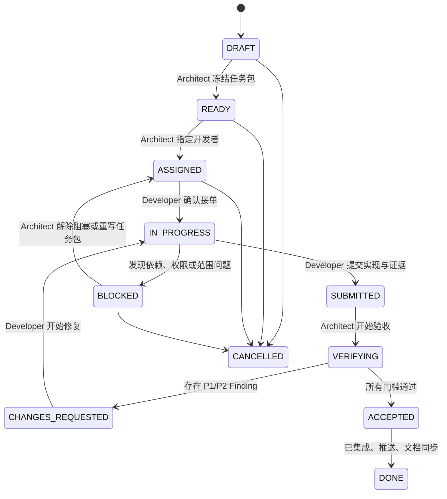

# 10. 委派开发与架构验收工作协议

- 状态：Accepted
- 日期：2026-08-11
- 适用范围：由总体设计者拆分工作、其他开发者实现、总体设计者最终验收和集成的所有 RelayHub 变更。

## 1. 目的

RelayHub 采用“总体设计者掌握架构与验收，开发者负责有边界的实现”的协作方式。工作不能只靠聊天中的一句需求，也不能由开发者自行宣布完成。

每项工作必须满足：

1. 有唯一 Work Item ID 和书面任务包。
2. 有唯一当前状态和当前责任人。
3. 开发者提交的是实现与证据，不是最终验收结论。
4. 总体设计者依据预先写明的标准独立验收。
5. 只有验收通过、集成到主分支、文档同步并推送后，任务才能标记为 `DONE`。

`docs/work-items/README.md` 是委派任务登记表；每项工作使用独立 Work Item 文件保存范围、证据、Findings 和最终提交。

## 2. 角色与权限

### 总体设计者 / Architect

负责：

- 维护整体目标、架构边界、领域模型和路线顺序。
- 创建 Work Item，定义范围、接口、验收标准和禁止事项。
- 决定依赖关系和分配开发者。
- 审查合约、migration、状态迁移、安全边界和架构一致性。
- 独立运行必要的自动化、集成和浏览器验收。
- 给出 `CHANGES_REQUESTED` 或 `ACCEPTED` 结论。
- 将已接受实现集成到 `main`，同步文档并推送 GitHub。

不能：

- 在验收时临时加入任务包未说明的大功能，再据此拒绝交付。
- 用个人偏好代替已经冻结的验收标准。
- 在缺少验证证据时直接标记 `ACCEPTED` 或 `DONE`。

### 开发者 / Implementer

负责：

- 在接受任务前阅读完整 Work Item、相关 ADR 和接口定义。
- 只修改任务包允许的范围；发现范围不足时先标记 `BLOCKED`。
- 实现代码、测试、migration 和必要文档。
- 完成本地自测、提交和 topic branch 推送。
- 提交结构化 Delivery Report，并把 Work Item 标记为 `SUBMITTED`。
- 根据验收 Findings 修复并重新提交。

不能：

- 自行改变产品目标、核心状态、数据所有权或安全边界。
- 未经总体设计者确认增加核心表、Task/Run 状态、NextAction、外部基础设施或通用 Workflow Engine。
- 直接把任务标记为 `ACCEPTED` 或 `DONE`。
- 以“代码写完”“本地能跑”代替完整交付证据。

### 独立 Reviewer（按风险选用）

高风险变更可以指定独立 Reviewer。Reviewer 提交 Findings 和建议结论，但最终 `ACCEPTED` 仍由总体设计者确认。作者不能充当自己变更的独立 Reviewer。

## 3. Work Item 状态机



### 状态定义与标记者

| 状态 | 含义 | 谁可以标记 | 必须附带的信息 |
|---|---|---|---|
| `DRAFT` | 正在设计任务，禁止开始实现 | Architect | 初步目标和背景 |
| `READY` | 范围、接口和验收标准已冻结 | Architect | 完整任务包、依赖和风险 |
| `ASSIGNED` | 已指定开发者，等待确认接单 | Architect | Owner、branch 名称、基线 SHA |
| `IN_PROGRESS` | 开发者已确认并开始实现 | Developer | 开始时间、计划修改范围 |
| `BLOCKED` | 无法在既定范围内继续 | Developer | 阻塞证据、已尝试方案、需要的决定 |
| `SUBMITTED` | 开发者认为实现可验收 | Developer | Delivery Report、commit、测试结果、已知风险 |
| `VERIFYING` | 总体设计者正在独立验收 | Architect | 验收开始时间和使用的基线 |
| `CHANGES_REQUESTED` | 未通过验收，需要修复 | Architect | 结构化 Findings 和复验要求 |
| `ACCEPTED` | 实现和证据已满足任务包 | Architect | Acceptance Report |
| `DONE` | 已进入 `main`、推送且文档一致 | Architect | main commit SHA、push 结果、最终验证 |
| `CANCELLED` | 工作停止且不会继续交付 | Architect | 原因和替代 Work Item（如有） |

规则：

- 不使用“基本完成”“90%”“待优化”等模糊状态。
- `SUBMITTED` 不等于完成；它只表示开发者把责任交给验收者。
- `ACCEPTED` 不等于已经发布；只有完成主分支集成和推送后才是 `DONE`。
- `DONE` 后发现回归，不改写历史结论；创建关联的新 Work Item。

## 4. 总体设计者如何创建和分配工作

### 第一步：建立任务包

Architect 从 `docs/work-items/TEMPLATE.md` 创建 `WI-<阶段>-<序号>-<slug>.md`，至少写明：

- 用户价值和业务目标。
- 当前系统事实与依赖。
- In scope / Out of scope。
- 架构不变量和禁止事项。
- 允许修改的模块。
- 合约、状态迁移、数据库和兼容要求。
- 自动化、集成、浏览器和故障验收标准。
- 交付物、回滚方案和 Definition of Done。

任务包在 `DRAFT` 阶段可以讨论；进入 `READY` 后，验收标准即冻结。需要实质改变范围时，由 Architect 修改任务包并记录 revision，不能只在聊天中追加要求。

### 第二步：检查可执行性

进入 `READY` 前，Architect 必须确认：

- 前置 Work Item 已经 `DONE`，或依赖可以明确并行。
- 不与其他进行中的工作修改同一核心边界；无法避免时指定集成顺序。
- 数据迁移、配置、费用、密钥或外部权限要求已经说明。
- 开发者可以在不猜测架构意图的情况下完成任务。

### 第三步：正式分配

Architect 在登记表中填写 Owner、topic branch、基线 SHA 和依赖，将状态改为 `ASSIGNED`。推荐 branch：

```text
work/<work-item-id>-<short-slug>
```

开发者阅读任务包并确认后，把状态改为 `IN_PROGRESS`。未确认前不得修改实现。

## 5. 开发者如何执行和提交

开发过程遵循以下顺序：

1. 从任务包指定的基线创建 topic branch。
2. 先验证当前基线和测试环境，再修改代码。
3. 优先修改合约和纯决策逻辑，再修改 persistence、runtime 和 UI。
4. migration 只能向前兼容，不删除或覆盖正式持久数据。
5. 每次范围变化先更新 Work Item 或标记 `BLOCKED`。
6. 运行任务包要求的测试、类型检查、构建和运行验收。
7. 更新受影响文档。
8. 提交 focused commit，推送 topic branch，并确认工作区干净。
9. 填写 Delivery Report，将状态改为 `SUBMITTED`。

### Delivery Report 必须包含

- 实现摘要。
- 实际修改文件和职责。
- 与任务包不同的地方及原因。
- 执行过的命令和准确结果。
- 数据库 migration、配置和兼容性影响。
- 浏览器、真实 CLI 或故障注入证据（如适用）。
- 未解决风险和非阻塞限制。
- branch、commit SHA、push 结果和 `git status`。

不得提交 API Key、密码、Token、隐藏推理或与任务无关的本地数据。

## 6. 总体设计者如何验收

Architect 接收 `SUBMITTED` 后先标记 `VERIFYING`，按以下顺序验收：

1. **任务包一致性**：逐条检查目标、In scope、Out of scope 和验收标准。
2. **架构一致性**：确认数据真相源、模块职责、状态所有权和权限边界没有漂移。
3. **代码审查**：检查错误路径、幂等、并发、兼容性和不必要复杂度。
4. **自动化验证**：独立运行目标测试和 `pnpm check` 或任务包指定门槛。
5. **集成验证**：使用隔离 PostgreSQL/Redis、临时 Git 仓库或 Mock runtime，不污染正式数据。
6. **真实运行验证**：涉及 CLI、浏览器或 Worker 生命周期时，按任务包执行真实路径。
7. **文档与 Git**：确认文档与实现一致、commit 聚焦、branch 已推送、工作区干净。

开发者报告的测试结果是验收输入，不替代 Architect 的独立验证。

### Finding 严重级别

| 等级 | 含义 | 对验收的影响 |
|---|---|---|
| `P1` | 数据、安全、权限、状态机或核心行为错误 | 必须 `CHANGES_REQUESTED` |
| `P2` | 明确违反任务包、重要回归或缺少必要测试 | 必须 `CHANGES_REQUESTED` |
| `P3` | 不阻塞当前目标的可维护性或体验改进 | 可以 `ACCEPTED`，另建后续 Work Item |

存在任何未解决的 P1/P2 时不得标记 `ACCEPTED`。

## 7. 验收通过后如何关闭

验收全部通过后：

1. Architect 在 Work Item 写入 Acceptance Report，并标记 `ACCEPTED`。
2. 将 topic branch 的已接受提交集成到 `main`。
3. 运行合并后的最终必要检查。
4. 同步路线图、实现状态、ADR 或接口文档。
5. 推送 `origin/main`。
6. 确认 `HEAD == origin/main` 且工作区干净。
7. 在 Work Item 和登记表记录最终 main commit SHA，将状态标记为 `DONE`。

`DONE` 的唯一判定式：

```text
验收通过
+ 已集成 main
+ 最终验证通过
+ 文档同步
+ GitHub 推送成功
+ 工作区干净
= DONE
```

## 8. 多人并行规则

- 一个 Work Item 只有一个 Owner；协作者写入 Contributors。
- 一个核心合约在同一时间只有一个 Work Item 可以修改。
- 可以并行的工作必须在任务包中写明共享接口和集成顺序。
- 开发者之间不通过未提交工作区隐式交接，只通过 branch、commit、Work Item 和正式接口交接。
- 后续任务不得依赖尚未 `ACCEPTED` 的实现；如必须提前并行，应固定 commit SHA 并明确返工风险。
- Architect 是唯一主分支集成责任人，开发者不得直接把未经验收的提交推入 `main`。

## 9. 适用于 RelayHub 的固定质量门槛

- 合约和状态迁移必须有表驱动测试。
- API/persistence 变更必须使用隔离数据库验证。
- Queue、Worker 和 token 变更必须覆盖重复、过期、取消或崩溃路径。
- UI 变更必须验证 loading、empty、error、terminal 和窄视口。
- Agent/CLI 变更必须验证权限、Worktree、Handoff、Review 和无密钥落库。
- 不使用正式 PostgreSQL、Redis 或用户仓库做破坏性测试。
- Mock 路径必须继续稳定；真实模型输出不能成为唯一自动化测试依据。
- 每项已接受变更必须更新最相关文档。

## 10. 第一个采用本协议的工作

下一项 Work Item 应是：真实 OpenCode Builder → Handoff V2 → Codex Reviewer 双路径验收。它在创建任务包并进入 `READY` 后，才能正式分配给开发者。
