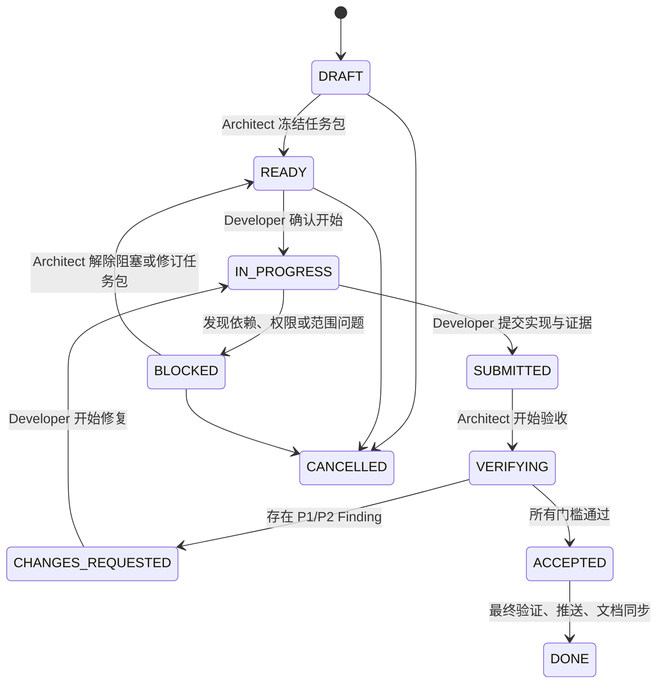

# 10. 委派开发与架构验收工作协议

- 状态：Accepted
- 日期：2026-08-11
- 适用范围：一名总体设计者向一名开发者委派工作，并由总体设计者最终验收和关闭的所有 RelayHub 变更。

## 1. 目的

RelayHub 当前采用“单 Architect、单 Implementer、单活跃计划”的协作方式。Architect 决定做什么、为什么做、架构边界和怎样算通过；Implementer 在这些约束内自主决定怎样实现。工作不能只靠聊天中的一句需求，也不能由开发者自行宣布完成。

每项工作必须满足：

1. 有唯一 Work Item ID 和书面任务包。
2. 有唯一当前状态和当前责任人。
3. 开发者提交的是实现与证据，不是最终验收结论。
4. 总体设计者依据预先写明的标准独立验收。
5. 只有验收通过、文档同步并推送后，任务才能标记为 `DONE`。
6. 任意时刻最多只有一个 Active Work Item；当前工作关闭前不启动下一项实现计划。
7. Architect 和 Developer 使用同一目录、同一 `main` 分支，但必须按状态严格串行，不能同时修改工作区。

`docs/work-items/README.md` 是委派任务登记表；每项工作使用独立 Work Item 文件保存范围、证据、Findings 和最终提交。

## 2. 角色与权限

### 总体设计者 / Architect

Architect 是唯一委派者，也是唯一验收与任务关闭责任人。

负责：

- 维护整体目标、架构边界、领域模型和路线顺序。
- 决定大特性、架构方向和路线顺序。
- 创建唯一活跃 Work Item，定义目标、范围、接口、验收标准和禁止事项。
- 审查合约、migration、状态迁移、安全边界和架构一致性。
- 独立运行必要的自动化、集成和浏览器验收。
- 给出 `CHANGES_REQUESTED` 或 `ACCEPTED` 结论。
- 验收 Developer 已推送到 `main` 的提交，同步 Acceptance/Closure 文档并完成最终推送。

不能：

- 在验收时临时加入任务包未说明的大功能，再据此拒绝交付。
- 用个人偏好代替已经冻结的验收标准。
- 在缺少验证证据时直接标记 `ACCEPTED` 或 `DONE`。
- 在不涉及架构不变量和验收要求时，替开发者规定内部类、函数、算法或逐步实现细节。

### 开发者 / Implementer

当前只有一名 Implementer，因此任务进入 `READY` 后不再设置单独的分配状态。Implementer 对约束范围内的实现方案负责。

负责：

- 在接受任务前阅读完整 Work Item、相关 ADR 和接口定义。
- 只修改任务包允许的范围；发现范围不足时先标记 `BLOCKED`。
- 实现代码、测试、migration 和必要文档。
- 自主决定模块内部拆分、算法、辅助抽象、测试组织和允许范围内的重构方式。
- 完成本地自测，在共享 `main` 上创建 focused commit 并推送 GitHub。
- 提交结构化 Delivery Report，并把 Work Item 标记为 `SUBMITTED`。
- 根据验收 Findings 修复并重新提交。

不能：

- 自行改变产品目标、核心状态、数据所有权或安全边界。
- 未经总体设计者确认增加核心表、Task/Run 状态、NextAction、外部基础设施或通用 Workflow Engine。
- 直接把任务标记为 `ACCEPTED` 或 `DONE`。
- 以“代码写完”“本地能跑”代替完整交付证据。

Architect 可以把静态检查、AI 审查或跨模型审查作为验收工具，但它们不是额外的流程角色，也不能替代 Architect 的最终结论。

## 3. Work Item 状态机



### 状态定义与标记者

| 状态 | 含义 | 谁可以标记 | 必须附带的信息 |
|---|---|---|---|
| `DRAFT` | 正在设计任务，禁止开始实现 | Architect | 初步目标和背景 |
| `READY` | 范围、接口和验收标准已冻结，可由唯一开发者开始 | Architect | 完整任务包、共享分支和风险 |
| `IN_PROGRESS` | 开发者已确认并开始实现 | Developer | 开始时间、计划修改范围 |
| `BLOCKED` | 无法在既定范围内继续 | Developer | 阻塞证据、已尝试方案、需要的决定 |
| `SUBMITTED` | 开发者认为实现可验收 | Developer | Delivery Report、commit、测试结果、已知风险 |
| `VERIFYING` | 总体设计者正在独立验收 | Architect | 验收开始时间和使用的基线 |
| `CHANGES_REQUESTED` | 未通过验收，需要修复 | Architect | 结构化 Findings 和复验要求 |
| `ACCEPTED` | 实现和证据已满足任务包 | Architect | Acceptance Report |
| `DONE` | 已验收、推送且文档一致 | Architect | main commit SHA、push 结果、最终验证 |
| `CANCELLED` | 工作停止且不会继续交付 | Architect | 原因和替代 Work Item（如有） |

规则：

- 不使用“基本完成”“90%”“待优化”等模糊状态。
- `SUBMITTED` 不等于完成；它只表示开发者把责任交给验收者。
- `SUBMITTED` 提交已经可以位于 `origin/main`，但这只代表交付可验收，不代表 `ACCEPTED`。
- `ACCEPTED` 不等于任务已关闭；只有 Acceptance/Closure 文档和最终验证一并推送后才是 `DONE`。
- `DONE` 后发现回归，不改写历史结论；创建关联的新 Work Item。
- `READY`、`IN_PROGRESS`、`BLOCKED`、`SUBMITTED`、`VERIFYING`、`CHANGES_REQUESTED` 和 `ACCEPTED` 合计最多只能有一个 Work Item。

## 4. 总体设计者如何制定唯一计划

### 第一步：建立任务包

Architect 从 `docs/work-items/TEMPLATE.md` 创建 `WI-<阶段>-<序号>-<slug>.md`，至少写明：

- 用户价值和业务目标。
- 当前系统事实与依赖。
- In scope / Out of scope。
- 架构不变量和禁止事项。
- 允许修改的模块。
- 合约、状态迁移、数据库和兼容要求。
- 自动化、集成、浏览器和故障验收标准。
- 交付物、回滚方案和 Definition of Done。
- 哪些决定属于 Architect，哪些实现选择留给 Developer。

任务包在 `DRAFT` 阶段可以讨论；进入 `READY` 后，验收标准即冻结。需要实质改变范围时，由 Architect 修改任务包并记录 revision，不能只在聊天中追加要求。

### 第二步：检查计划槽位和可执行性

进入 `READY` 前，Architect 必须确认：

- 登记表中没有其他 Active Work Item；上一项工作已经 `DONE` 或 `CANCELLED`。
- 当前任务本身可以独立验收，不依赖尚未实现的隐含后续任务。
- 数据迁移、配置、费用、密钥或外部权限要求已经说明。
- 开发者可以在不猜测架构意图的情况下完成任务。

### 第三步：发布计划并交出共享工作区

Architect 在登记表中登记 Work Item，将共享分支写为 `main`，并把状态改为 `READY`。发布前必须确认：

- 当前工作在 `main`。
- `HEAD == origin/main`。
- 工作区干净。
- Architect 已停止修改工作区。

唯一开发者阅读任务包并确认后，先记录接手时的 `HEAD` 为 Baseline commit，再把状态改为 `IN_PROGRESS`。从此直到 `SUBMITTED` 或 `BLOCKED`，共享目录由 Developer 独占，Architect 不进行文件修改。在目标、边界、接口和验收标准不变的前提下，开发者不需要为每个内部实现选择再次申请批准；如果必须越过边界，则提交现有安全进度、推送并标记 `BLOCKED`，等待 Architect 接管和修订计划。

## 5. 开发者如何执行和提交

开发过程遵循以下顺序：

1. 确认位于共享 `main`、工作区干净且 `HEAD == origin/main`，记录该 SHA 为 Baseline commit。
2. 将 Work Item 标记为 `IN_PROGRESS`，提交并推送这次状态交接，再修改实现。
3. 优先修改合约和纯决策逻辑，再修改 persistence、runtime 和 UI。
4. migration 只能向前兼容，不删除或覆盖正式持久数据。
5. 每次范围变化先更新 Work Item 或标记 `BLOCKED`。
6. 运行任务包要求的测试、类型检查、构建和运行验收。
7. 更新受影响文档，并填写 Delivery Report。
8. 在共享 `main` 创建 focused implementation commit；需要多个提交时保持每个提交职责单一。
9. 将 Work Item 状态改为 `SUBMITTED`，创建最终交付提交，推送 `origin/main`，并确认 `HEAD == origin/main`、工作区干净。

### Delivery Report 必须包含

- 实现摘要。
- 实际修改文件和职责。
- 与任务包不同的地方及原因。
- 执行过的命令和准确结果。
- 数据库 migration、配置和兼容性影响。
- 浏览器、真实 CLI 或故障注入证据（如适用）。
- 未解决风险和非阻塞限制。
- Baseline SHA、提交范围、最终 commit SHA、`origin/main` push 结果和 `git status`。

不得提交 API Key、密码、Token、隐藏推理或与任务无关的本地数据。

## 6. 总体设计者如何验收

Architect 接收 `SUBMITTED` 后先标记 `VERIFYING`，按以下顺序验收：

1. **任务包一致性**：逐条检查目标、In scope、Out of scope 和验收标准。
2. **架构一致性**：确认数据真相源、模块职责、状态所有权和权限边界没有漂移。
3. **代码审查**：检查错误路径、幂等、并发、兼容性和不必要复杂度。
4. **自动化验证**：独立运行目标测试和 `pnpm check` 或任务包指定门槛。
5. **集成验证**：使用隔离 PostgreSQL/Redis、临时 Git 仓库或 Mock runtime，不污染正式数据。
6. **真实运行验证**：涉及 CLI、浏览器或 Worker 生命周期时，按任务包执行真实路径。
7. **文档与 Git**：确认文档与实现一致、commit 聚焦、Developer 提交范围已推送 `origin/main`、工作区干净。

开发者报告的测试结果是验收输入，不替代 Architect 的独立验证。

### Finding 严重级别

| 等级 | 含义 | 对验收的影响 |
|---|---|---|
| `P1` | 数据、安全、权限、状态机或核心行为错误 | 必须 `CHANGES_REQUESTED` |
| `P2` | 明确违反任务包、重要回归或缺少必要测试 | 必须 `CHANGES_REQUESTED` |
| `P3` | 不阻塞当前目标的可维护性或体验改进 | 可以 `ACCEPTED`，另建后续 Work Item |

存在任何未解决的 P1/P2 时不得标记 `ACCEPTED`。

## 7. 验收通过后如何关闭

验收全部通过后：

1. Architect 在 Work Item 写入 Acceptance Report，并标记 `ACCEPTED`。
2. 运行共享 `main` 上的最终必要检查；不再执行分支合并。
3. 同步路线图、实现状态、ADR 或接口文档。
4. 在 Work Item 写入 Closure，将状态标记为 `DONE`。
5. 提交并推送 `origin/main`。
6. 确认 `HEAD == origin/main` 且工作区干净。
7. 在登记表记录最终 main commit SHA，并将 Work Item 移入 Recently completed。

`DONE` 的唯一判定式：

```text
验收通过
+ 已在共享 main 验收
+ 最终验证通过
+ 文档同步
+ GitHub 推送成功
+ 工作区干净
= DONE
```

## 8. 单开发者、单计划规则

- `docs/work-items/README.md` 的 Active 区最多登记一项工作。
- Architect 只有在当前 Work Item 已经 `DONE` 或 `CANCELLED` 后，才制定下一项正式实现计划。
- 路线图、想法和候选特性可以提前记录，但不能同时变成多个 Active Work Item。
- Developer 只推进当前 Work Item，不自行从路线图领取下一项工作。
- Architect 不把一个特性拆成需要并行协调的多个活跃任务；必要时在同一个 Work Item 内按验收切片顺序执行。
- Architect 与 Developer 共用同一目录和 `main`，同一时间只有当前状态责任人可以修改文件。
- 每次角色交接都必须先提交、推送并留下干净工作区，禁止通过未提交文件隐式交接。
- Developer 可以把 `SUBMITTED` 提交推送到 `origin/main`；推送是传输和审计事实，不等于验收。只有 Architect 可以标记 `ACCEPTED` 和 `DONE`。
- `VERIFYING` 期间 Developer 不修改工作区；`CHANGES_REQUESTED` 后 Architect 先提交并推送 Findings，再把工作区交还 Developer。

## 9. 适用于 RelayHub 的固定质量门槛

- 合约和状态迁移必须有表驱动测试。
- API/persistence 变更必须使用隔离数据库验证。
- Queue、Worker 和 token 变更必须覆盖重复、过期、取消或崩溃路径。
- UI 变更必须验证 loading、empty、error、terminal 和窄视口。
- Agent/CLI 变更必须验证权限、Worktree、Handoff、Review 和无密钥落库。
- 不使用正式 PostgreSQL、Redis 或用户仓库做破坏性测试。
- Mock 路径必须继续稳定；真实模型输出不能成为唯一自动化测试依据。
- 每项已接受变更必须更新最相关文档。

## 10. 第一个采用本协议的工作

首个正式计划是 [`WI-P3.4-001：顺序型平台 Agent 动态 Handoff`](work-items/WI-P3.4-001-sequential-agent-handoff.md)，状态为 `READY`。它关闭前不创建第二项活跃计划。
