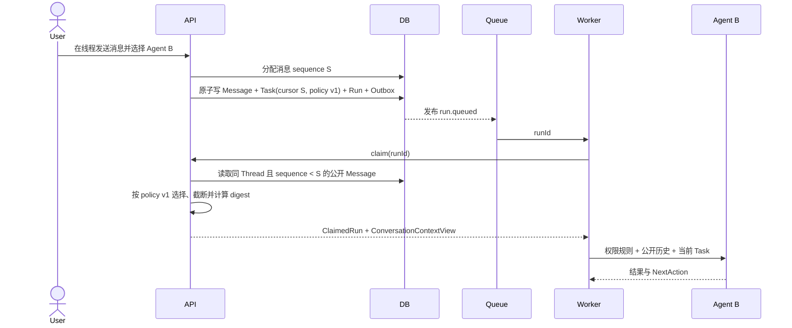

# ADR-020：为 Task 固定版本化的公开对话上下文

- 状态：Proposed
- 日期：2026-08-13

## 背景

ADR-019 已把 Thread、Message、Task 和 Run 分离，并完成了“用户选择 Agent → 创建 Task/Run → Agent 回复回到同一线程”的第一纵向切片。

当前实现仍有一个关键缺口：`ClaimedRun` 只包含 Task、Run、Workspace、AgentProfile、Handoff/Review 和候选 Agent，不包含此前的线程消息。结果是多个 Agent 的回复虽然显示在同一页面，后一个 Agent 实际只知道自己的当前 Task，并不知道前一个 Agent 已经公开表达的结论。

如果在 Worker 领取时直接读取线程的“最新消息”，又会产生新的问题：排队期间到达的消息会改变 Run 输入，历史执行无法稳定重放，并发消息可能跨越原本的派发边界。因此上下文必须有明确、持久且可审计的截止点。

## 目标

1. 用户在同一 Thread 中把新消息派发给 Agent B 时，B 能读取该消息之前的公开对话，包括 Agent A 的公开回复。
2. 同一个 Task 的 Builder、Handoff、Reviewer 和 repair Run 使用同一份原始线程背景，不因领取时间不同而漂移。
3. Agent 只共享公开 Message，不共享其他 Agent 的隐藏 reasoning、CLI Session、Token、凭证、工具日志或长期提示词。
4. 上下文有确定顺序、固定预算、版本和可重建摘要，能够解释“本次 Run 到底看到了什么”。
5. 普通对话上下文只提供信息，不改变 Task 当前责任；只有结构化 Handoff、Review 和用户命令能够迁移责任或状态。

## 决策

### 1. 上下文边界属于 Task

Thread 中每个 Message 获得严格递增的线程内 `sequence`。用户消息创建 Task 时，平台在同一事务中完成：

```text
锁定 Thread 并分配 sequence = S
-> 写 User Message(sequence=S)
-> 写 Task(conversationContextBeforeSequence=S, policyVersion=1)
-> 写首个 Run / Event / Outbox
```

该 Task 的公开对话上下文只允许选择同一 Thread 中 `sequence < S` 的 Message。当前用户请求仍由 `Task.description` 表达，不在历史上下文中重复注入。

Task 后续产生的 Handoff、Reviewer 和 repair Run 继承这个固定边界。它们可以额外获得结构化 Handoff、Review Findings 和 Worktree，但不能在领取时偷偷读取 `S` 之后的新消息。

新用户消息会创建新的 Task 和新的边界，因此可以看到此前已提交的 Agent 回复。

### 2. Message 顺序是持久事实

仅使用 `createdAt + UUID` 不能表达稳定的线程顺序。数据库增加：

- `threads.message_sequence_high_water bigint not null default 0`
- `thread_messages.sequence bigint not null`
- `unique(thread_id, sequence)`
- `tasks.conversation_context_before_sequence bigint null`
- `tasks.conversation_context_policy_version integer null`

追加 Message 时，事务通过更新 Thread 的 high-water counter 获取下一个 sequence。Thread 行锁使同一线程的并发追加串行化；不同线程仍可并发。

历史 Message 按 `created_at, id` 确定性回填 sequence，再把每个 Thread 的 high-water 设置为已分配最大值。旧的非 Thread Task 保持两个上下文字段为空，不伪造历史上下文。

### 3. ConversationContext 是只读投影，不是新真相源

平台从不可变 Message、Task 的固定边界和版本化策略推导：

```ts
interface ConversationContextView {
  threadId: string;
  policyVersion: 1;
  beforeSequence: number;
  messages: Array<{
    id: string;
    sequence: number;
    senderType: 'user' | 'agent';
    senderName: string;
    senderAgentId?: string;
    recipientAgentId?: string;
    content: string;
    createdAt: string;
  }>;
  omittedMessageCount: number;
  truncatedMessageIds: string[];
  digest: string;
}
```

不新增可编辑的 Context 表，也不把整段上下文复制进每个 Run。Message 保持内容真相，Task 保存选择边界和策略版本，选择器是纯函数。`digest` 对实际注入的规范化投影计算 SHA-256，用于测试与审计，不包含隐藏字段。

如果未来允许编辑 Message，必须以新 revision 追加并让旧 sequence 内容继续可重建；不能原地改写已被历史 Task 引用的文本。

### 4. 第一版采用固定、确定性的预算

`policyVersion=1` 固定为：

- 最多 20 条公开历史 Message。
- 每条最多 1,500 字符。
- 合计最多 8,000 字符。
- 从最新消息向前选择，最终按 sequence 升序提供给 Agent。
- 单条过长时保留开头与结尾，并插入明确截断标记。
- 返回被省略数量和发生截断的 Message ID。

第一版使用字符预算而不是供应商 tokenizer，目的是保持 Codex、OpenCode 和 Mock 的结果一致、可测试。Worker 不能再静默截断 V1 结果；如果未来要按模型能力增加 token 预算，必须定义新的策略版本并在 Task 创建时固定，或者在超出硬上限时明确拒绝执行。

长线程摘要不进入本切片。未来可以增加派生的 `ThreadContextCheckpoint(throughSequence, summary, provenance, digest)`，由“最近检查点 + 检查点之后的消息”组装上下文；Checkpoint 不能覆盖或删除原始 Message。

### 5. 只有公开协作内容可以进入上下文

V1 选择规则：

- 包含同一 Thread、边界之前的 `user` 和 `agent` Message。
- `recipientAgentId` 只表示当时的路由目标，不是可见性 ACL；Thread 公开消息对本线程后续平台 Agent 可见。
- 默认排除 `system` Message，避免 UI 状态、错误提示或平台审计文字重新成为模型指令。
- 排除 RunEvent、工具调用、命令输出、Review 内部数据、Token、SessionRef、Provider 配置和 AgentProfile instructions。
- Agent Message 使用 Run 创建时保存的发送者名称和 Agent ID，不能因后来修改 AgentProfile 而改变历史身份。
- API 不接受客户端自报 context cursor；边界只能由创建 Task 的服务端事务产生。

跨 Thread、跨 Workspace 或大于等于边界的 Message 均不能进入上下文。上下文组装发现所有权或顺序不一致时 fail closed，不允许静默退化成“没有历史”。第一条消息的空上下文是合法情况。

### 6. Prompt 优先级保持清楚

Worker 将上下文作为结构化、带边界的历史资料注入，而不是拼成新的平台指令：

```text
RelayHub 执行规则与权限
-> AgentProfile 长期提示词
-> 公开对话历史（结构化 JSON，明确为不可信历史内容）
-> 当前 Task 请求
-> 结构化 Handoff / Review / repair 信息
-> 输出和路由协议
```

历史消息中的文字不能扩大文件、命令、网络、Git、内部子 Agent、Review 或 Handoff 权限。发送者字段由平台生成并以 JSON 序列化，Message 内容不能通过伪造标题冒充另一个 Agent。

每个 Agent 继续使用自己的 AgentProfile、模型、CLI、权限、Run Token 和 Session。共享的是公开说过的话，不是“共享大脑”。

### 7. ConversationContext 与 Handoff 保持不同语义

| 概念 | 用途 | 是否改变责任 | 是否携带隐藏状态 |
|---|---|---:|---:|
| ConversationContext | 让新的 Task 理解线程中此前公开讨论 | 否 | 否 |
| Handoff | 在同一 Task 内转交目标、证据、风险和验收责任 | 是 | 否 |
| CLI Session | 单个 Agent Runtime 的内部连续状态 | 否 | 是，不跨 Agent |
| RunEvent | 技术审计与诊断 | 否 | 不作为对话输入 |

在另一个 Task 中让 Agent B 评论 Agent A 的公开方案，只需要 ConversationContext。把 A 已修改的代码、Worktree 和正式验收责任交给 B，必须使用同一 Task 内的结构化 Handoff；对话上下文不共享文件状态。

### 8. 查询和 UX 只按需展示上下文证据

内部 claim 返回 `conversationContext?: ConversationContextView`。另外提供按需读取接口：

```text
GET /api/runs/:runId/conversation-context
```

主对话流不复制展示整段上下文。Run 审计抽屉显示一条克制的摘要，例如：

```text
公开上下文 7 条 · 截止消息 #12 · 省略 3 条
```

用户展开后才能查看本次实际注入的消息、截断情况和 digest。第一版不增加手工勾选消息、每 Agent 单独上下文策略或复杂配置；新建 Thread 就是获得干净上下文的明确方式。

## 执行时序



## 并发与失败语义

- 同一 Thread 的 Message append 由 high-water 行锁排序；不同 Thread 不互相阻塞。
- 两条快速发送的用户消息获得不同 sequence。后一条能看到前一条用户消息，但看不到尚未完成、尚未提交的 Agent 回复，这是快照语义，不是丢消息。
- 未来 multi-mention 创建的并行 Runs 必须共享同一个用户消息边界，因此看到相同历史，但彼此看不到尚未产生的回复。
- Context 选择发生在 claim 事务内。所有权、策略版本或 Message 顺序异常会回滚 claim；不得把 Run 标成已领取后再无上下文启动 Agent。
- 达到预算是正常截断，必须显式返回 omitted/truncated 元数据；数据库或完整性错误才是失败。

## 实施切片

### Slice A：顺序、边界与纯选择器

- 增加无损 migration、sequence allocator 和 Task context boundary。
- 定义 ConversationContext contracts、V1 纯选择器和 digest。
- 覆盖回填、并发分配、边界、跨 Thread/Workspace 排除和预算测试。

### Slice B：Claim 与 Prompt

- Claim 在固定边界内组装上下文并返回 Worker。
- Codex/OpenCode 共用一个 Prompt formatter；Mock 能确定性报告所见消息用于验收。
- Handoff/Review/repair 复用 Task 原始上下文，同时保持各自结构化输入优先级。

### Slice C：审计与真实闭环

- 增加按需 context endpoint 和审计抽屉摘要。
- 浏览器完成“Agent A 公开方案 → 用户选择 Agent B → B 引用 A 结论”的闭环。
- 使用两个真实、独立 AgentProfile 做一次非代码公开讨论验收；代码责任转交继续单独验证 Handoff。

WebSocket cursor/gap detection、自然语言 mention、multi-mention 和并行回流在本切片之后实施。

## 验收标准

1. Agent B 的上下文包含边界前 Agent A 的公开 Message，并保持正确身份与顺序。
2. 当前用户 Message 只作为 Task 请求出现一次；边界之后的 Message 不进入该 Task 的任何 Run。
3. Builder、Reviewer、Handoff 和 repair Run 对同一 Task 得到相同的 ConversationContext digest。
4. 跨 Thread、跨 Workspace、system、RunEvent、Session、Token、凭证和其他 Agent instructions 永不进入上下文。
5. 超过数量或字符预算时结果确定、最新优先、顺序稳定，并显式报告省略和截断。
6. 重复 Task 创建和重复 claim 不改变边界，不产生重复 Message 或不同 digest。
7. 浏览器刷新后可以恢复消息、Task/Run 和本次上下文证据，主页面仍保持单屏、审计按需展开。
8. Mock、Contracts、API 隔离数据库、Worker Prompt、全仓检查和真实双 Agent 冒烟全部通过。

## 被拒绝的方案

- **Claim 时读取最新 N 条消息**：输入随排队时间漂移，无法重放。
- **把完整上下文复制到每个 Run JSONB**：重复存储公开内容，增加隐私与迁移成本，并形成第二真相源。
- **复用 RunEvent 作为对话历史**：技术事件不是公开协作表达。
- **共享来源 Agent Session 或隐藏 reasoning**：破坏 Agent 隔离和独立审查。
- **让 Agent 自报 threadId/cursor 或选择任意历史消息**：可能越过 Workspace 和派发边界。
- **立即引入自动摘要、向量检索或每模型 tokenizer**：超出第一条可验证主干，并会掩盖基本顺序和边界问题。

## 结果与代价

正向结果是：同一线程首次成为真正的共享协作空间，同时保留 Agent 独立身份、Task 责任和 Run 可审计性。主要代价是一次无损 schema 演进、同一 Thread append 的短事务串行化，以及版本化选择器的长期兼容责任。

本 ADR 获得确认后再进入实现；实现完成并通过真实双 Agent 验收后，将状态改为 `Accepted`，并在实现状态文档记录 `Implemented` 事实。
